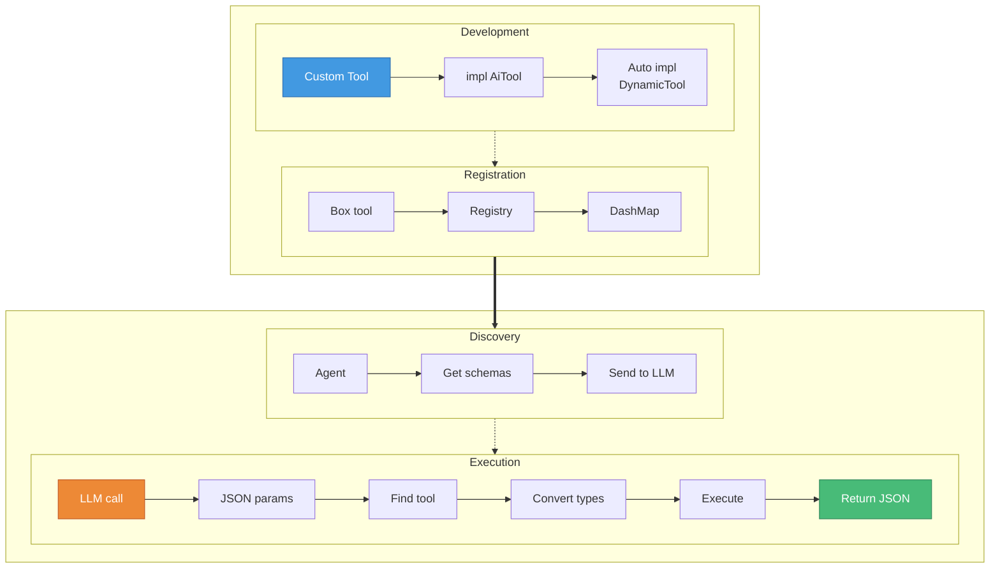

# Pattern Tool System Development

Pattern's tool system enables agents to perform actions through a type-safe, extensible framework. Tools are functions that agents can call during conversations to interact with memory, send messages, search data, or perform custom operations.

## Core Components

### 1. The `AiTool` Trait

```rust
#[async_trait]
pub trait AiTool: Send + Sync {
    type Input: JsonSchema + DeserializeOwned + Serialize + Send;
    type Output: JsonSchema + Serialize + Send;

    fn name(&self) -> &str;
    fn description(&self) -> &str;

    async fn execute(&self, params: Self::Input) -> Result<Self::Output>;

    // Optional: Usage rules for context
    fn usage_rule(&self) -> Option<&'static str> { None }
}
```

This trait provides compile-time type safety for tool inputs and outputs.

### 2. The `DynamicTool` Trait

```rust
#[async_trait]
pub trait DynamicTool: Send + Sync {
    fn name(&self) -> &str;
    fn description(&self) -> &str;
    fn input_schema(&self) -> Value;
    fn usage_rule(&self) -> Option<&'static str>;

    async fn execute_dynamic(&self, params: Value) -> Result<Value>;
}
```

This trait enables dynamic dispatch and runtime tool discovery.

### 3. The Bridge: `impl<T: AiTool> DynamicTool for T`

Pattern automatically implements `DynamicTool` for any type that implements `AiTool`. This bridge:
- Converts typed inputs/outputs to/from JSON
- Generates JSON schemas from Rust types
- Preserves type safety while enabling dynamic dispatch

## Flow Diagram



## Creating a Custom Tool

### Step 1: Define Your Input/Output Types

```rust
#[derive(Debug, Clone, Serialize, Deserialize, JsonSchema)]
struct WeatherInput {
    city: String,
    #[serde(default)]
    units: String,  // "metric" or "imperial"
}

#[derive(Debug, Clone, Serialize, JsonSchema)]
struct WeatherOutput {
    temperature: f32,
    description: String,
    humidity: u8,
}
```

### Step 2: Implement the Tool

```rust
#[derive(Debug, Clone)]
struct WeatherTool {
    api_key: String,
}

#[async_trait]
impl AiTool for WeatherTool {
    type Input = WeatherInput;
    type Output = WeatherOutput;

    fn name(&self) -> &str {
        "get_weather"
    }

    fn description(&self) -> &str {
        "Get current weather for a city"
    }

    async fn execute(&self, params: Self::Input) -> Result<Self::Output> {
        // Implementation that calls weather API
        Ok(WeatherOutput {
            temperature: 22.5,
            description: "Partly cloudy".to_string(),
            humidity: 65,
        })
    }

    fn usage_rule(&self) -> Option<&'static str> {
        Some("Use this tool when the user asks about weather or temperature in a specific location.")
    }
}
```

### Step 3: Register with the Tool Registry

```rust
// Register in the shared tool registry
let weather_tool = WeatherTool { api_key: "...".to_string() };
registry.register_dynamic(weather_tool.clone_box());
```

## Built-in Tools

Pattern includes several built-in tools following the Letta/MemGPT pattern:

### Memory Management (`block`)
- `append`: Add content to memory blocks
- `replace`: Replace specific content in memory
- `archive`: Move memory to long-term storage
- `swap`: Atomic archive + load operation

### Archival Storage (`recall`)
- `insert`: Store new archival memories
- `read`: Retrieve specific memories by label
- `delete`: Remove archival memories

### Search (`search`)
- Unified interface for searching across:
  - Archival memories
  - Conversation history
  - (Extensible to other domains)

### Communication (`send_message`)
- Send messages to users or other agents
- Supports different message types and metadata
- Has built-in rule: "the conversation will end when called"

## Tool Rules System

Pattern includes a sophisticated tool rules system that allows fine-grained control over tool execution flow, dependencies, and constraints. This enables agents to follow complex workflows, enforce tool ordering, and optimize performance.

### Rule Types

```rust
pub enum ToolRuleType {
    /// Tool starts the conversation (must be called first)
    StartConstraint,

    /// Maximum number of times this tool can be called
    MaxCalls(u32),

    /// Tool ends the conversation loop when called
    ExitLoop,

    /// Tool continues the conversation loop when called
    ContinueLoop,

    /// Minimum cooldown period between calls
    Cooldown(Duration),

    /// This tool must be called after specified tools
    RequiresPreceding,
    ...
}
```

### Configuring Tool Rules

Tool rules can be configured in three ways:

#### 1. In TOML Configuration

```toml
[agent]
name = "DataProcessor"
tools = ["load_data", "validate", "process", "save_results"]

[[agent.tool_rules]]
tool_name = "load_data"
rule_type = "StartConstraint"
priority = 10

[[agent.tool_rules]]
tool_name = "validate"
rule_type = "RequiresPreceding"
conditions = ["load_data"]
priority = 8

[[agent.tool_rules]]
tool_name = "process"
rule_type = { MaxCalls = 3 }
priority = 5

[[agent.tool_rules]]
tool_name = "save_results"
rule_type = "ExitLoop"
priority = 9
```

#### 2. Via CLI Commands

```bash
# Add a rule that makes 'send_message' end the conversation
pattern agent add rule MyAgent send_message exit-loop

# Add a dependency rule
pattern agent add rule MyAgent validate requires-preceding -c load_data

# Add a max calls rule
pattern agent add rule MyAgent api_request max-calls -p 5

# Remove rules for a tool
pattern agent remove rule MyAgent send_message
pattern agent remove rule MyAgent send_message exit-loop
```

#### 3. Programmatically

```rust
use pattern_core::agent::tool_rules::{ToolRule, ToolRuleType};

let rules = vec![
    ToolRule {
        tool_name: "initialize".to_string(),
        rule_type: ToolRuleType::StartConstraint,
        conditions: vec![],
        priority: 10,
        metadata: None,
    },
    ToolRule {
        tool_name: "cleanup".to_string(),
        rule_type: ToolRuleType::ExitLoop,
        conditions: vec![],
        priority: 9,
        metadata: None,
    },
];

// Rules are passed to AgentRuntime builder
let runtime = AgentRuntime::builder()
    .agent_id(agent_id)
    .tool_rules(rules)
    // ... other config
    .build()?;
```

### How Tool Rules Work

1. **Start Constraints**: Tools marked with `StartConstraint` are automatically executed when a conversation begins
2. **Dependencies**: Tools with `RequiresPreceding` can only be called after their prerequisite tools
3. **Call Limits**: Tools with `MaxCalls` enforce usage limits per conversation
4. **Loop Control**:
   - `ExitLoop` tools terminate the conversation after execution
   - `ContinueLoop` tools don't require heartbeat checks (performance optimization)
5. **Cooldowns**: Prevent rapid repeated calls to expensive tools

### Rule Enforcement

The ToolExecutor validates every tool call before execution:

```rust
// If a tool violates a rule, the agent receives an error:
"Tool rule violation: Tool 'process' cannot be executed: prerequisites ['validate'] not met"
```

### Performance Benefits

Tool rules enable performance optimizations:

1. **Heartbeat Optimization**: Tools marked with `ContinueLoop` skip heartbeat checks, reducing overhead
2. **Early Termination**: `ExitLoop` tools prevent unnecessary continuation prompts
3. **Automatic Initialization**: `StartConstraint` tools run automatically without LLM prompting

### Example: ETL Pipeline Agent

```toml
[[agent.tool_rules]]
tool_name = "connect_db"
rule_type = "StartConstraint"
priority = 10

[[agent.tool_rules]]
tool_name = "extract_data"
rule_type = "RequiresPreceding"
conditions = ["connect_db"]
priority = 8

[[agent.tool_rules]]
tool_name = "transform_data"
rule_type = "RequiresPreceding"
conditions = ["extract_data"]
priority = 7

[[agent.tool_rules]]
tool_name = "load_warehouse"
rule_type = "RequiresPreceding"
conditions = ["transform_data"]
priority = 6

[[agent.tool_rules]]
tool_name = "disconnect_db"
rule_type = "ExitLoop"
priority = 10
```

This ensures the ETL pipeline executes in the correct order and terminates cleanly.

## Common Patterns

### Multi-Operation Tools

Tools often support multiple operations:

```rust
#[derive(Debug, Clone, Serialize, Deserialize, JsonSchema)]
struct BlockInput {
    operation: BlockOperation,
    #[serde(flatten)]
    params: BlockParams,
}

#[derive(Debug, Clone, Serialize, Deserialize, JsonSchema)]
#[serde(tag = "type", rename_all = "snake_case")]
enum BlockOperation {
    Append,
    Replace,
    Archive,
    Swap,
}
```

### Error Handling

Tools should return descriptive errors:

```rust
async fn execute(&self, params: Self::Input) -> Result<Self::Output> {
    match params.operation {
        FileOperation::Read => {
            let content = tokio::fs::read_to_string(&params.path)
                .await
                .map_err(|e| CoreError::FileReadError {
                    path: params.path.clone(),
                    reason: e.to_string(),
                })?;
            Ok(FileOutput { content: Some(content), ..Default::default() })
        }
        // ...
    }
}
```

## Accessing Runtime Services

Tools that need runtime services (memory, routing, model) should hold an `Arc<AgentRuntime>` and access it through the `ToolContext` trait:

```rust
#[derive(Debug)]
struct MyTool {
    runtime: Arc<AgentRuntime>,
}

impl MyTool {
    pub fn new(runtime: Arc<AgentRuntime>) -> Self {
        Self { runtime }
    }
}

#[async_trait]
impl AiTool for MyTool {
    type Input = MyInput;
    type Output = MyOutput;

    fn name(&self) -> &str { "my_tool" }
    fn description(&self) -> &str { "A tool that needs runtime access" }

    async fn execute(&self, params: Self::Input) -> Result<Self::Output> {
        // Access runtime services through ToolContext trait
        let ctx = self.runtime.as_ref() as &dyn ToolContext;

        // Access memory
        let memory = ctx.memory();
        let block = memory.get_block(ctx.agent_id(), "some_block").await?;

        // Access router for messaging
        let router = ctx.router();

        // Access model for LLM calls
        if let Some(model) = ctx.model() {
            // Use model for classification, etc.
        }

        // Access source manager for data sources
        if let Some(sources) = ctx.sources() {
            let stream_ids = sources.list_streams();
        }

        Ok(MyOutput { /* ... */ })
    }
}
```

The `ToolContext` trait provides:
- `agent_id()` - Current agent's ID
- `memory()` - MemoryStore for block operations
- `router()` - Message routing to users, agents, groups
- `model()` - Optional model provider for LLM calls within tools
- `permission_broker()` - Consent request handling
- `sources()` - Data source management
- `shared_blocks()` - Cross-agent block sharing

## Troubleshooting

### "Tool not found" Errors

- Check tool is registered: `registry.list_tools()`
- Verify name matches exactly (case-sensitive)
- Ensure tool is in agent's `available_tools()`

### Schema Generation Issues

- All fields must implement `JsonSchema`
- Use `#[schemars(default, with = "InnerType")]` for optional fields
- Avoid complex generic types in Input/Output

### Concurrent Execution Problems

- Tools must be `Send + Sync`

### Type Conversion Errors

- Test JSON serialization separately
- Use `#[serde(rename_all = "snake_case")]` consistently
- Handle null/missing fields with `Option<T>` or defaults correctly

## Advanced Topics

### Tool Composition

Tools can call other tools through the registry:

```rust
async fn execute(&self, params: Self::Input) -> Result<Self::Output> {
    // First search for relevant data via the registry
    let search_result = self.registry
        .execute("search", json!({
            "domain": "archival_memory",
            "query": params.topic
        }))
        .await?;

    // Then process the results
    // ...
}
```

### Custom Memory Backend

For a custom memory backend, implement `MemoryStore`:

```rust
use pattern_core::memory::{MemoryStore, MemoryResult, StructuredDocument};

#[derive(Debug)]
struct CustomMemoryStore { /* ... */ }

#[async_trait]
impl MemoryStore for CustomMemoryStore {
    async fn create_block(&self, agent_id: &str, label: &str, ...) -> MemoryResult<String> {
        // Custom storage logic
    }

    async fn get_block(&self, agent_id: &str, label: &str)
        -> MemoryResult<Option<StructuredDocument>>
    {
        // Custom retrieval logic
    }

    // ... implement other methods
}

// Provide to RuntimeContext builder
let ctx = RuntimeContext::builder()
    .dbs_owned(dbs)
    .memory(Arc::new(CustomMemoryStore::new()))
    .build()
    .await?;
```

## Future plans

- WASM-based custom tool loading at runtime
