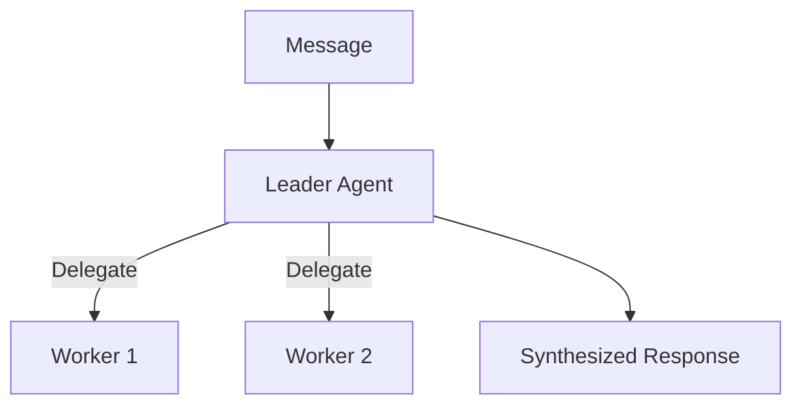
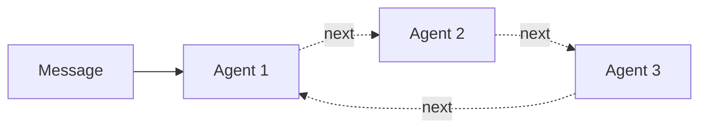
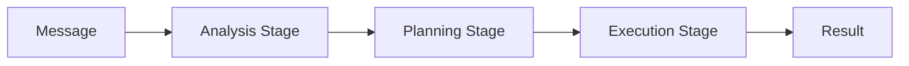
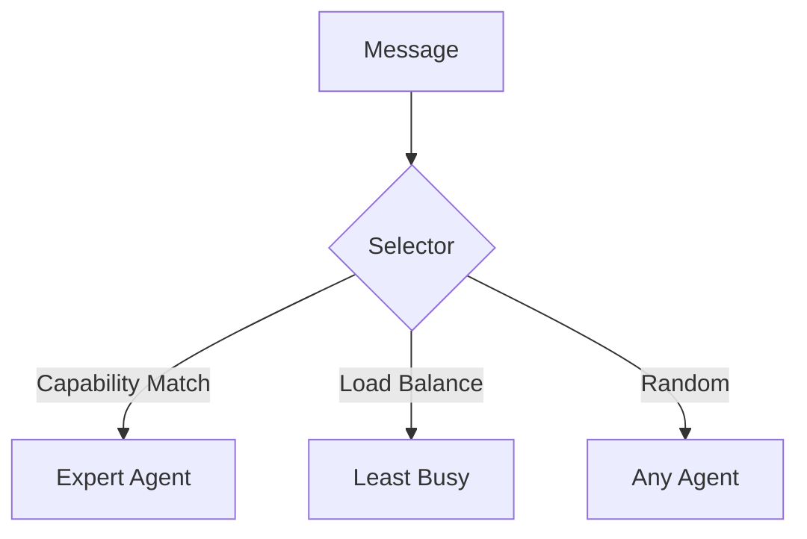
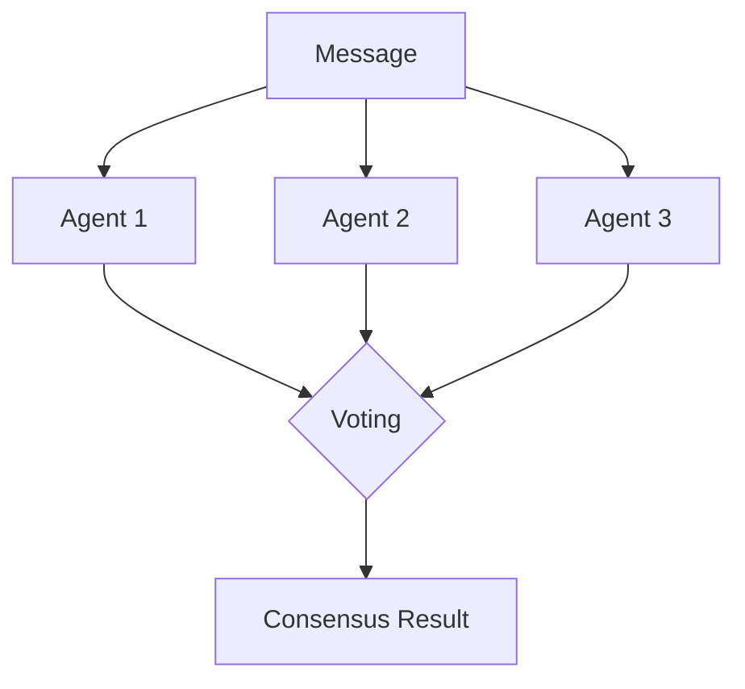
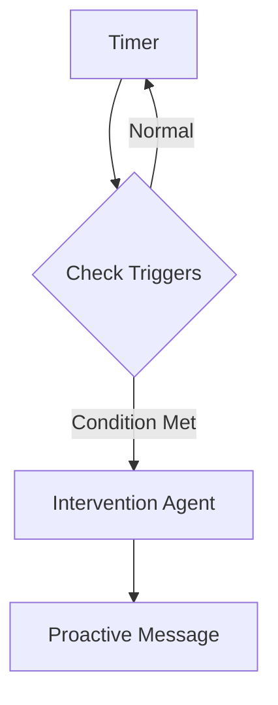

# Pattern Group Coordination

Pattern's group coordination system enables multiple agents to work together through various patterns. This guide covers how to create, configure, and use agent groups.

## Core Concepts

### Agent Groups

A group is a collection of agents that coordinate using a specific pattern:

```rust
pub struct AgentGroup {
    pub id: GroupId,
    pub name: String,
    pub description: String,
    pub coordination_pattern: CoordinationPattern,
    pub state: GroupState,
    pub members: Vec<(AgentModel, GroupMembership)>,
}
```

### Coordination Patterns

Six patterns are available:

```rust
pub enum CoordinationPattern {
    Supervisor { leader_id, delegation_rules },
    RoundRobin { current_index, skip_unavailable },
    Voting { quorum, voting_rules },
    Pipeline { stages, parallel_stages },
    Dynamic { selector_name, selector_config },
    Sleeptime { check_interval, triggers, intervention_agent_id },
}
```

### Member Roles

```rust
pub enum GroupMemberRole {
    Regular,                    // Standard member
    Supervisor,                 // Group leader
    Observer,                   // Receives messages but doesn't respond
    Specialist { domain: String }, // Expert in a domain
}
```

## Coordination Patterns Explained

### Supervisor

One agent leads, delegating tasks to others:



```toml
[groups.pattern]
type = "supervisor"
leader = "Pattern"

[groups.pattern.delegation_rules]
max_delegations_per_agent = 3
delegation_strategy = "capability"  # round_robin, least_busy, random
fallback_behavior = "handle_self"   # queue, fail
```

**Use Cases:**
- Task delegation with oversight
- Quality control
- Hierarchical coordination

### Round Robin

Agents take turns in order:



```toml
[groups.pattern]
type = "round_robin"
skip_unavailable = true  # Skip inactive agents
```

**Use Cases:**
- Fair distribution of work
- Load balancing
- Team discussions

### Pipeline

Sequential processing through stages:



```toml
[groups.pattern]
type = "pipeline"
stages = ["Analyzer", "Planner", "Executor"]
parallel_stages = false

# Stage failure handling (in code)
# on_failure = "skip" | "retry" | "abort" | "fallback"
```

**Use Cases:**
- Multi-step workflows
- Analysis pipelines
- Document processing

### Dynamic

Context-based agent selection:



```toml
[groups.pattern]
type = "dynamic"
selector = "capability"  # random, load_balancing, supervisor

[groups.pattern.selector_config]
preferred_domain = "task_management"
```

**Available Selectors:**
- `random`: Random selection
- `capability`: Match message content to agent capabilities
- `load_balancing`: Select least recently used agent
- `supervisor`: LLM-based selection by supervisor agent

**Special Addressing:**
- `@all`: Broadcast to all active agents
- `@agentname` or `agentname:`: Route directly to named agent

### Voting

Agents vote on decisions:



```toml
[groups.pattern]
type = "voting"
quorum = 3

[groups.pattern.voting_rules]
voting_timeout = 30  # seconds
tie_breaker = "random"  # first_vote, no_decision, or specific_agent
weight_by_expertise = true
```

**Use Cases:**
- Critical decisions
- Consensus building
- Multi-perspective evaluation

### Sleeptime

Background monitoring with intervention triggers:



```toml
[groups.pattern]
type = "sleeptime"
check_interval = 1200  # 20 minutes
intervention_agent = "Pattern"

[[groups.pattern.triggers]]
name = "hyperfocus_check"
priority = "high"
[groups.pattern.triggers.condition]
type = "time_elapsed"
duration = 5400  # 90 minutes

[[groups.pattern.triggers]]
name = "activity_sync"
priority = "medium"
[groups.pattern.triggers.condition]
type = "constellation_activity"
message_threshold = 20
time_threshold = 3600
```

**Trigger Conditions:**
- `time_elapsed`: Duration since last activity
- `pattern_detected`: Named pattern recognition
- `threshold_exceeded`: Metric over threshold
- `constellation_activity`: Message count or time thresholds
- `custom`: Custom evaluator

**Use Cases:**
- ADHD hyperfocus monitoring
- Periodic check-ins
- Background task management

## Configuration

### TOML Configuration

Full group configuration in `constellation.toml`:

```toml
[[groups]]
name = "Main Support"
description = "Primary ADHD support team"

[groups.pattern]
type = "dynamic"
selector = "capability"

[[groups.members]]
name = "Pattern"
config_path = "agents/pattern/agent.toml"
role = "supervisor"
capabilities = ["coordination", "planning", "emotional_support"]

[[groups.members]]
name = "Entropy"
config_path = "agents/entropy/agent.toml"
role = { specialist = { domain = "task_breakdown" } }
capabilities = ["task_analysis", "decomposition", "prioritization"]

[[groups.members]]
name = "Archive"
config_path = "agents/archive/agent.toml"
role = "regular"
capabilities = ["memory", "recall", "pattern_recognition"]

# Data source routing to group
[groups.data_sources.bluesky]
type = "bluesky"
name = "bluesky"
target = "Main Support"
```

### CLI Commands

```bash
# List groups
pattern group list

# Create group (interactive TUI builder)
pattern group create

# Create group from TOML template
pattern group create --from crisis.toml

# Add member
pattern group add member "Crisis Response" Pattern --role regular

# View status
pattern group status "Crisis Response"

# Edit group (interactive TUI builder)
pattern group edit "Crisis Response"

# Export configuration
pattern group export "Crisis Response" -o crisis.toml
```

## Response Streaming

Groups emit events during message processing:

```rust
pub enum GroupResponseEvent {
    Started { group_id, pattern, agent_count },
    AgentStarted { agent_id, agent_name, role },
    TextChunk { agent_id, text, is_final },
    ReasoningChunk { agent_id, text, is_final },
    ToolCallStarted { agent_id, call_id, fn_name, args },
    ToolCallCompleted { agent_id, call_id, result },
    AgentCompleted { agent_id, agent_name, message_id },
    Complete { group_id, pattern, execution_time, agent_responses, state_changes },
    Error { agent_id, message, recoverable },
}
```

### Usage Example

```rust
use pattern_core::coordination::{DynamicManager, DefaultSelectorRegistry};

let registry = Arc::new(DefaultSelectorRegistry::new());
let manager = DynamicManager::new(registry);

let mut stream = manager.route_message(&group, &agents, message).await?;

use tokio_stream::StreamExt;
while let Some(event) = stream.next().await {
    match event {
        GroupResponseEvent::TextChunk { agent_id, text, .. } => {
            println!("[{}]: {}", agent_id, text);
        }
        GroupResponseEvent::Complete { execution_time, .. } => {
            println!("Completed in {:?}", execution_time);
        }
        _ => {}
    }
}
```

## Group State

Each pattern maintains its own state:

```rust
pub enum GroupState {
    Supervisor { current_delegations: HashMap<AgentId, usize> },
    RoundRobin { current_index, last_rotation },
    Voting { active_session: Option<VotingSession> },
    Pipeline { active_executions: Vec<PipelineExecution> },
    Dynamic { recent_selections: Vec<(DateTime<Utc>, AgentId)> },
    Sleeptime { last_check, trigger_history, current_index },
}
```

State is automatically updated after each message and persisted to the database.

## Memory Sharing

Agents in a group can share memory blocks:

```rust
// Share a block with another agent
db.share_block(owner_id, block_id, recipient_id, MemoryPermission::ReadOnly).await?;

// Access shared content
let doc = memory.get_shared_block(recipient_id, owner_id, "shared_notes").await?;
```

Shared blocks appear in context with attribution:

```xml
<block:shared_notes permission="ReadOnly" shared_from="Archive">
Cross-agent insights about user patterns
</block:shared_notes>
```

## Best Practices

### Pattern Selection

| Pattern | Best For |
|---------|----------|
| Supervisor | Delegation, quality control |
| RoundRobin | Fair distribution, load balancing |
| Pipeline | Sequential workflows |
| Dynamic | Expertise matching |
| Voting | Critical decisions |
| Sleeptime | Background monitoring |

### Agent Capabilities

Define specific, actionable capabilities:

```toml
# Good - specific and matchable
capabilities = ["task_breakdown", "time_estimation", "priority_analysis"]

# Too vague - hard to match
capabilities = ["help", "support"]
```

### Group Composition

- Keep groups focused (3-7 members typically optimal)
- Mix complementary capabilities
- Assign clear roles
- Consider overlapping group memberships for different contexts

### Overlapping Groups

The same agent can belong to multiple groups:

```
Pattern Agent
├── Main Support (Dynamic)
├── Crisis Response (RoundRobin)
├── Planning (Supervisor - as member)
└── Sleeptime (Sleeptime - as intervener)
```

## Troubleshooting

### "No agents available"

1. Check agent states: `pattern agent list`
2. Verify group membership: `pattern group status <name>`
3. For capability selector: Ensure agents have matching capabilities

### Round-robin skipping agents

1. Check `skip_unavailable` setting
2. Verify member `is_active` status
3. Review agent logs for errors

### Pipeline stage failures

1. Check timeout settings
2. Verify stage agents are available
3. Review `on_failure` action (skip, retry, abort, fallback)

### Dynamic selection issues

1. Enable debug logging: `RUST_LOG=pattern_core::coordination=debug`
2. Check selector configuration
3. Verify agent capabilities match message content
